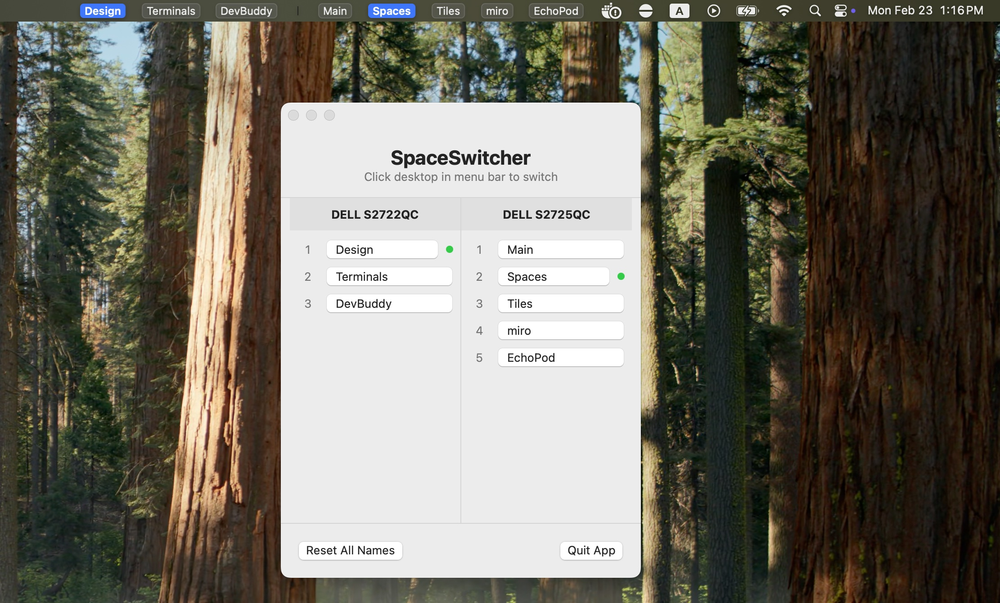

# 🖥️ SpaceSwitcher

A lightweight macOS menu bar app for managing and switching virtual desktops (Spaces).


## Features

- 📌 **Menu Bar Display** - All desktops shown directly in menu bar with styled buttons
- 🖥️ **Multi-Display Support** - Shows desktops for all connected displays, sorted by physical position
- 🖱️ **One-Click Switch** - Left click to instantly switch desktop
- ✏️ **Custom Names** - Rename desktops in settings window
- 🎯 **Current Indicator** - Active desktop highlighted with accent color
- ⚡ **Lightweight** - Native Swift, minimal resource usage

## Screenshot



```
┌───┐ ┌───┐ ┌───┐ ┌───┐    ┌───┐ ┌───┐ ┌───┐
│ 1 │ │ 2 │ │ 3 │ │ 4 │  | │ A │ │ B │ │ C │
└───┘ └───┘ └───┘ └───┘    └───┘ └───┘ └───┘
  └─── Display 1 ───┘    │   └ Display 2 ┘
                     separator
```

- Current desktop shown with colored background
- Multiple displays separated by `|`
- Displays ordered left-to-right based on physical arrangement

## Requirements

- macOS 13.0 or later
- **Accessibility permission** required (for simulating keyboard shortcuts)
- **Keyboard shortcuts enabled**: System Settings → Keyboard → Keyboard Shortcuts → Mission Control → Enable "Switch to Desktop 1-10"

## Installation

### Download Release

Download the latest `SpaceSwitcher.zip` from [Releases](../../releases), extract and move `SpaceSwitcher.app` to `/Applications`.

**First launch**: Right-click the app → Open → Click "Open" to confirm (required for unsigned apps).

### Build from Source

```bash
git clone https://github.com/user/SpaceSwitcher.git
cd SpaceSwitcher

# Build
swiftc \
    -o SpaceSwitcherApp \
    -framework Cocoa \
    -framework SwiftUI \
    -framework ApplicationServices \
    -parse-as-library \
    SpaceSwitcher/SpaceSwitcherApp.swift

# Create app bundle
mkdir -p SpaceSwitcher.app/Contents/MacOS
mkdir -p SpaceSwitcher.app/Contents/Resources
cp SpaceSwitcherApp SpaceSwitcher.app/Contents/MacOS/SpaceSwitcher
cp SpaceSwitcher/Info.plist SpaceSwitcher.app/Contents/

# Install
cp -r SpaceSwitcher.app /Applications/
```

## Setup

1. **Enable keyboard shortcuts**:
   - Open System Settings → Keyboard → Keyboard Shortcuts → Mission Control
   - Enable "Switch to Desktop 1", "Switch to Desktop 2", etc.

2. **Grant Accessibility permission**:
   - Open System Settings → Privacy & Security → Accessibility
   - Click `+` and add SpaceSwitcher.app
   - Make sure it's checked

3. **Launch the app**:
   ```bash
   open /Applications/SpaceSwitcher.app
   ```

## Usage

| Action | Result |
|--------|--------|
| Left click on desktop | Switch to that desktop |
| Open app again | Show settings window |

### Settings Window

- Opens automatically on first launch
- Reopen the app to access settings again
- Multi-column layout showing all displays
- Rename desktops by typing in the text fields
- Displays are arranged left-to-right matching your physical setup

## How It Works

SpaceSwitcher uses:
- `CGEvent` API to simulate `Ctrl + Number` keyboard shortcuts
- macOS private `SkyLight.framework` to read current Space information
- `com.apple.spaces` defaults to get desktop list
- `NSScreen` to detect display arrangement and sort displays

## Launch at Login

1. Open System Settings → General → Login Items
2. Click `+` under "Open at Login"
3. Select SpaceSwitcher.app

## Limitations

- Supports up to 10 desktops total across all displays (limited by Ctrl+1~0 shortcuts)
- Requires keyboard shortcuts to be enabled in System Settings

## License

MIT License

## Contributing

Issues and Pull Requests are welcome!
